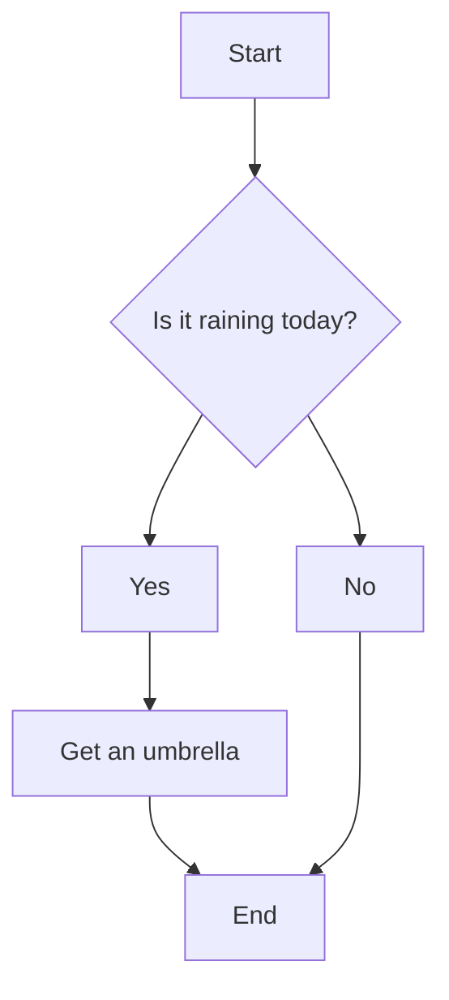

<p align="center">
  
</p>

Many times during the software development process is easier and more direct to explain complex concepts using diagrams and images, instead of using only text. And to fill this niche there's a tool called Mermaid.

From its website, [Mermaid](https://github.com/mermaid-js/mermaid) is a Javascript based diagramming and charting tool that uses Markdown-inspired text definitions and a renderer to create and modify complex diagrams. This is essencial to help in the process of documening software, which are growing rapidly.

The news is that now this tool have native integration with GitHub's Markdown, making it possible to easily add different diagrams to  project READMEs.

## First Steps

To use Mermaid in GitHub, we only have to use the commom syntax like so:

````
```mermaid
 — the code written here will be rendered and appear as images —
```
````

## Flowcharts

With that in mind, how can we draw a flowchart, a very useful diagram to teach programming? We have the following example.

````

````

As we've seen, the first line tells GitHub to render this code in Mermaid. The next line tells us what kind of diagram we want, in this case a _flowchart_, and its orientation: _TD_ for _Top Down_. Other formatting options are easily found at the [documentation](https://mermaid-js.github.io/mermaid/#/).

Following on the code we have the flowchart itself. We can make it as complex or as simple as we want. Here the amount of hyphens (a minimun of 2) will resize the arrows in the final image. With the code above we get the following result.

<p align="center">
  
</p>

To be continued